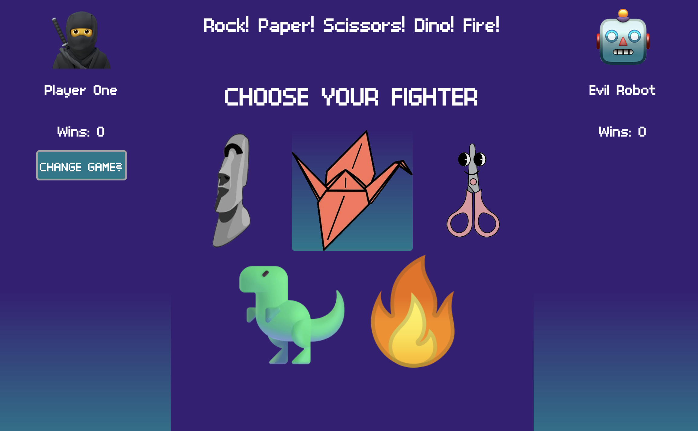

### Abstract:
[//]: <> (Briefly describe what you built and its features. What problem is the app solving? How does this application solve that problem?)
The build is a "Classic" Rock/Paper/Scissors (RPS) game, with an additional option to play an "Advanced" RPS game with five items (in this build, "Dinosaur" and "Fire" were added options, with updated rules where each item has *two* unique strengths and weaknesses each). 

After selecting an option of "Classic" or "Advanced" RPS, the user has the ability to select their "Fighter" icon of choice. After the click event, the computer player ("EVIL ROBOT") will randomly generate an item against the user. A "results" display is presented for 1.5 seconds showing the items selected from each and outcome of the match. 

At any point outside of the "Choose Game" screen and "results" display, the user has the ability to click a "CHANGE GAME?" button that re-presents them with the original "Home Screen" with "Classic" or "Advanced" game selections. 

After each win by user or computer, the "Wins" count in each profile gets added +1 for every respective win in a match. A tie does not reflect an update for either win count. 

### Live GitHub Site:
[//]: <> (What site can a person access your live site?)
https://zachwolek.github.io/rock-paper-scissors/

 ### Installation Instructions:
[//]: <> (What steps does a person have to take to get your app cloned down and running?)
1) Access the form here: https://github.com/zachwolek/rock-paper-scissors
2) Copy the SSH repository URL `git@github.com:zachwolek/rock-paper-scissors.git`
3) Open terminal and 'cd' into the directory you wish to clone 
4) Clone the repository by submitting `git clone git@github.com:zachwolek/rock-paper-scissors.git`

### Preview of App:
[//]: <> (Provide ONE gif or screenshot of your application - choose the "coolest" piece of functionality to show off.)
The project has the ability to to select any item across two separate games, with a hover event that helps the user see the weapon choice

### Context:
[//]: <> (Give some context for the project here. How long did you have to work on it? How far into the Turing program are you?)
The solo project was received the project on Tuesday, February 27. The project took about four evenings to build a strong JS core and HTML layout without errors, with the final two days for cleaning redundancies, tightening design, and beautification. I am entering my 6th week of my 1st Mod in Turing. 

### Contributors:
[//]: <> (Who worked on this application? Link to their GitHubs.)
Zach Wolek: https://github.com/zachwolek/

### Learning Goals:
[//]: <> (What were the learning goals of this project? What tech did you work with?)
The learning goals of the project were to develop an understanding of integrating CSS, Javascript, and HTML. Specifically, a goal that required different unique HTML/CSS outputs for randomized JS circumstances. In a RPS match that required rules and elements, the goals were to create an appropriate set out consequences for every plausible RPS matchup.  

### Wins + Challenges:
[//]: <> (What are 2-3 wins you have from this project? What were some challenges you faced - and how did you get over them?)
 1) The strongest win was doing the project on my own and being fully responsible for every line of code. At the very beginning there were a few fundamental oversights in planning out JS and HTML specifically, which created a ripple of effects. 
2) A second win was learning how to help your webpage become accessible with disabilities, in that while alternative texts were provided for the main images, I learned by trial and error this also applies when inserting HTML from the Javascript

